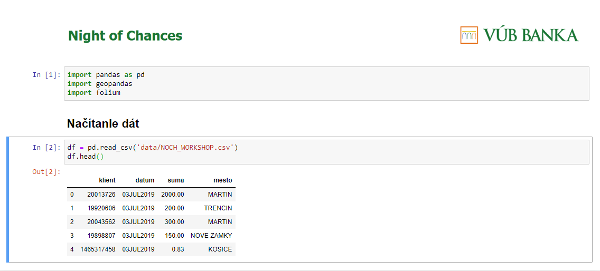
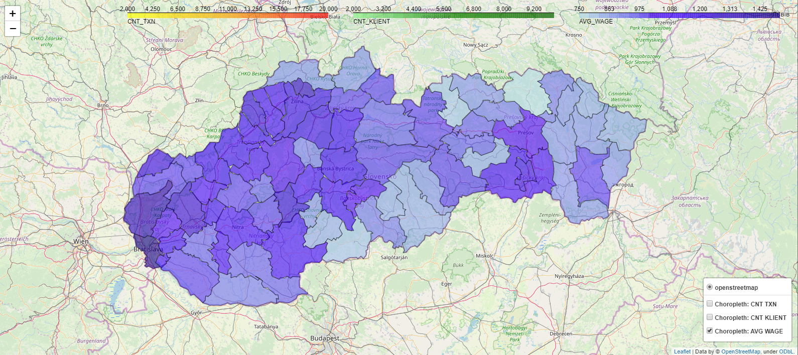

# Night of Chances 2020 - VUB Data Science Workshop

Geovisualization of bank customer transaction behaviour on Slovakia

## Prerequisites:
  1) download latest version anaconda (add python to classpath checkbox), https://www.anaconda.com/distribution/#download-section
  2) open console `cmd`, `conda install jupyter pandas geopandas descartes xlrd`
  3) `conda install folium -c conda-forge`
  4) `pip uninstall pyproj` (old version 1.9.*)
  4) `pip install pyproj==2.5.0` (if necessary - delete folder pyproj)
  6) `jupyter notebook`, open `NOCH-VUB-WORKSHOP.ipynb`

## Jupyter

## Example

